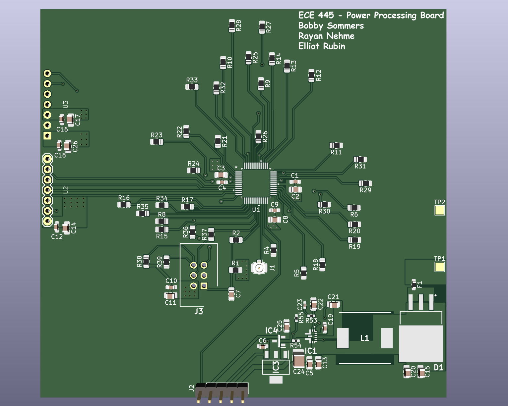

# Bobby's Notebook
---
## Februaury 1st, 2024
I started doing preliminary research into FMCW and pulsed radar architectures. I also watched a few YouTube videos on RF PCB layout design recommendations. [Link](https://www.youtube.com/watch?v=WMH6eHYXP8Y)

## February 8th, 2024
The team has been working on our project proposal all week. I specifically have been working on determining what variables we will need to be keeping track of in order to successfully retrieve a distance measurement. I also determined what the requirements of the processing unit will be in order to be considered a success.

## February 22nd, 2024
These past 2 weeks the team has been working on preliminary schematic designs for our Design Document. I specifically have been working on the processing unit schematic.
 

## February 29th, 2024
Practiced for the initial Design review that happened earlier this week. Also completed the power/processing unit layout.

## March 7th, 2024
First wave of PCB orders have been placed. I also simulated the SPI traces in HFSS to simulate the crosstalk between adjacent traces in case we used the very high speed SPI setting on the PIC Microcontroller. Cantennas are also being constructed.

## March 28st, 2024
PCBWay order was placed for the PPU (power/processing unit) earlier in the week. I've also been helping Elliot in soldering and testing the RF Board. Some initial issues on the RF Board have come to light as our amplifiers are not functioning as hoped.

## April 4th, 2024
PPU Board arrived on Monday and soldering has begun. I forgot to include a stencil for this board so everything will need to be soldered by hand. We also did not order enough parts (resistors, caps) so we had to make a nother order with the supply shop. Cantennas are fabricated and functional over the frequency band (2.25GHz - 2.5GHz).

## April 18th, 2024
I finished soldering the PPU Board earlier in the week and the power requirements have all been met, other than reverse polarity protection due to are decision to no longer use a Li-Ion battery. We had our mock demo today and it went well. We have also started to plan on how we will conduct our final demo next week.

## April 25th, 2024
We completed our final demo yesterday and it went pretty well. Earlier in the week we were having some big issues in our ability to code and flash the MCU. We decided to scrap that idea and just go with using the PIC dev board we had becuase it was decided that that would allow us to show our project functionality better. We started making our final presentation slides as well.

## May 1st, 2024
Our final presentation was yesterday and it went very well. We may not have had 100% functionality of our Radar but we learned a lot about RF engineering design principles as well as how to work well in a team setting.
