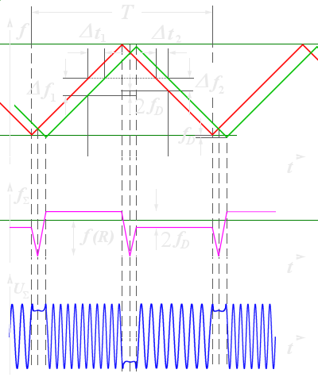
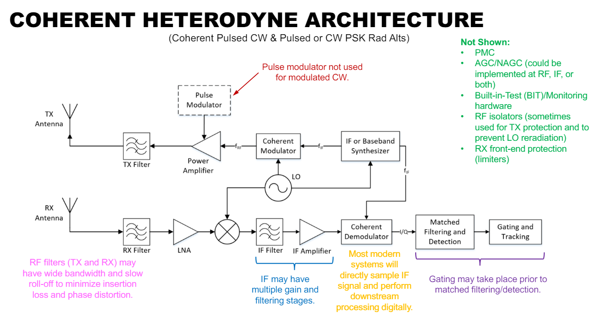
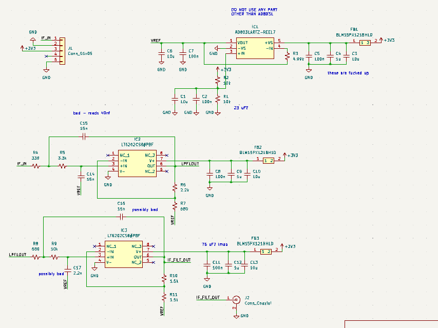
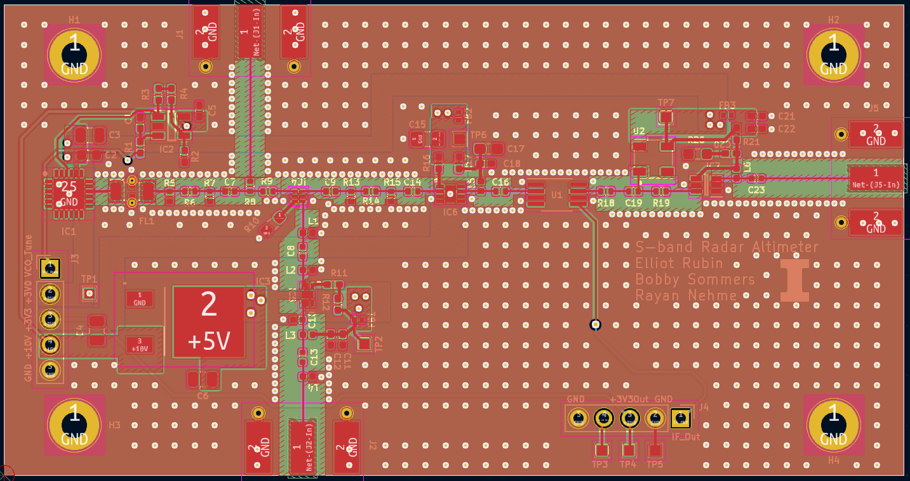
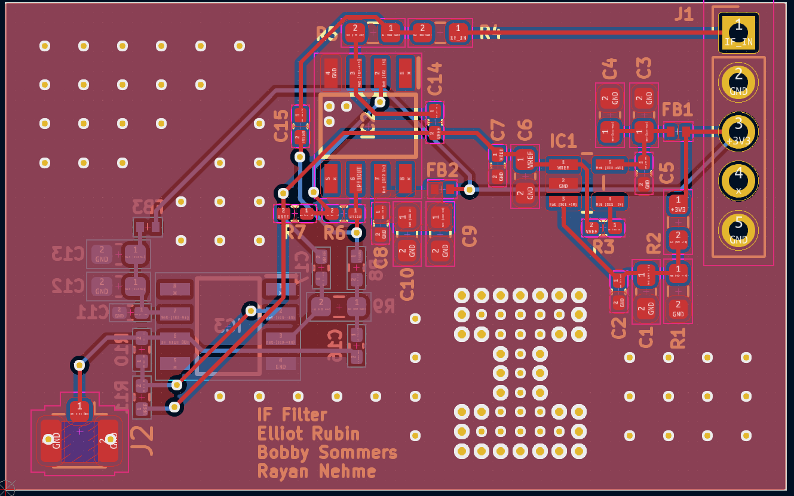
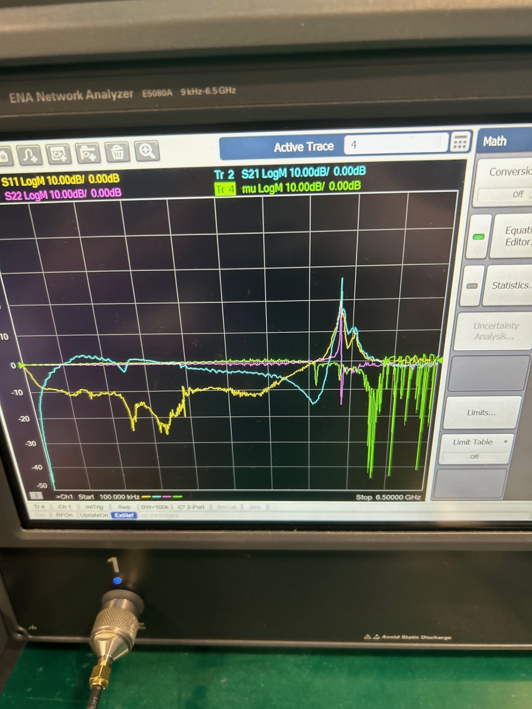
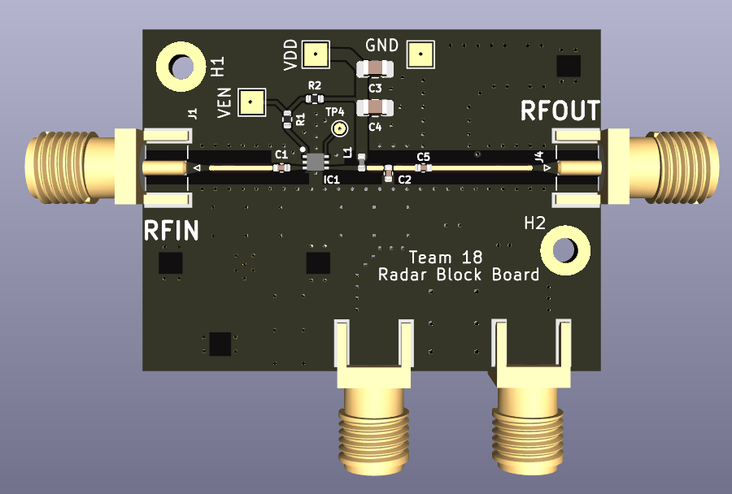

# Elliot's Notebook
---

## 2024/01/25
Since we decided on a FMCW radar altimeter, I decided to do some research into how these work. I found a useful presentation from some aerospace company on the typical operation of these [radar altimeters](https://avsi.aero/wp-content/uploads/2021/12/Radar-Altimeter-Overview-of-Design-and-Performance.pdf). There is some signal processing involved but I think we can get away with an FMCW architecture like I found [here] (https://www.radartutorial.eu/02.basics/Frequency%20Modulated%20Continuous%20Wave%20Radar.en.html): 

We will discuss the circuit implementation as a group in the coming week. Also I submitted the project approval.

## 2024/02/01
We decided on something like this from the presentation I linked last week:

I am not sure about the VCO/mixer but amps and passives are very cheap. The boards will be expensive though. With this decision made, we began thinking about our proposal.

## 2024/02/08
I made some progress on a preliminary version of the radar layout. It is based on this [radar](https://hforsten.com/6-ghz-frequency-modulated-radar.html) from a Finnish DSP expert. I think this is a good project to take inspiration from, although it operates at a higher frequency than what we were planning to do. Also we talked as a group with Professor Stephen Bass, who teaches ECE 454. We consulted him regarding different antenna topologies that we could use and decided on some sort of Yagi antenna. Hopefully I have a finished PCB by next week so that we can simulate it.
The proposal was also due today, hopefully it is approved.

## 2024/02/20
The design document is due this week so we have been working hard on that. We performed some analysis on the radar link budget with the parts that we picked. This analysis was carried out according to [another radar built by Henrik from Finland](https://hforsten.com/third-version-of-homemade-6-ghz-fmcw-radar.html). He goes in depth into noise floor, range, etc. Meanwhile, I have a schematic/layout finished. I will continue to optimize it.

## 2024/03/04
PCBs are due soon but I finished the RF board. We also designed an IF filter using Analog Devices' filter wizard: 

Both of these boards will be ordered tomorrow. Here is the RF board layout:

and the IF board layout:

We will order parts soon ish.

## 2024/03/22
We got our sets of boards and assembled them. The VCO works but the PA does not. I also messed up choosing an LNA part for this board so we are submitting a new revision, this time it's through OSHPark. The new revision uses two GRF4002W amps because they have a high OP1dB and also a low noise figure. Meanwhile, I am chasing down issues with the PA on our current board because it is behaving as an attenuator.

## 2024/04/05
We do not have the OSHPark boards yet so we have focused on the power/processing unit as well as writing code. I wrote code to generate the modulating triangle wave earlier, so we are now trying to communicate via SPI. There are example projects for PIC MCUs that I found on MPLAB Discover from Microchip, hopefully they help. Also I put together the cantennas.

## 2024/04/09
I put together the new RF board and tried to test it, but something weird is going on. Somehow the first board I put together is immediately shorted in the PA section so I will have to explore more.

## 2024/04/16
I understand what's going on with the amps, kind of. They are somehow not properly terminated and are oscillating. I have killed several amps already. We will probably need a new board. Next time, follow [these guidelines](https://www.guerrilla-rf.com/support/application/notes/amp-power-up-down-procedures) before powering on the amps.

## 2024/04/21
We decided to order new boards with our own money. These are modular so the hope is that we can assemble them and use them as system blocks to make debugging easier. I am hoping they arrive before the demo which is approaching very fast.

