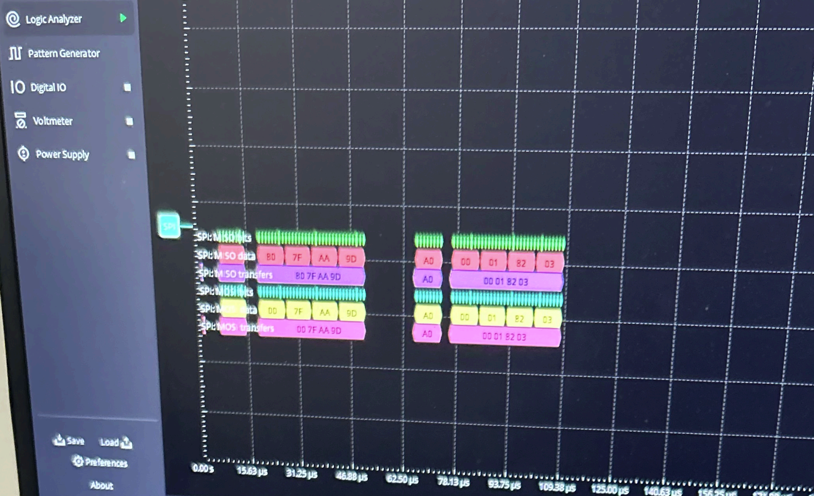

# Rayans Notebook

## February 1st, 2024
We have just gotten our project approved early and have decided to settle on a S-Band Radar Altimeter. This project seems especially interesting. Research has begun on how exactly we want to tackle our project. We understand that it is going to be RF-heavy and involve using communication protocols. I have started reading up on different communication protocols like I2C and SPI.     

https://deepbluembedded.com/spi-tutorial-with-pic-microcontrollers/

https://www.ti.com/lit/an/slva704/slva704.pdf?ts=1714610528263&ref_url=https%253A%252F%252Fwww.google.com%252F 

## February 8th, 2024
We have been working on our proposal as a team. This means coming up with high level requirements and determining what will be a success for the project. I personally have been helping to determine the high level requirements for the power unit. 

https://www.circuitbasics.com/voltage-regulators/

## February 15th, 2024
This was a lighter week nothing is really due on the calendar. We have our design review around the corner but not for another two weeks. I have been brainstorming ways on how we are going to combine our different subsystems together specifically the power and processing unit. It is looking like we are going to put them on a single PCB.

## February 22nd, 2024
This week our design document was due so our team grinded it out all week. I worked on the cost, schedule and labor sections as well as the sections related to the power unit. At this point I was really trying to determine how we were going to make our buck-boost converter. 

https://www.electronicdesign.com/technologies/power/article/21273499/renesas-electronics-dc-dc-converter-design-basics-part-3-buck-boost-converters

## February 29th, 2024
Our design review went well this week. The first round of PCB orders are around the corner. We want to get these in before spring break. I am really pushing to complete the power unit subsystem. I have been using a website called “TI Webench Power Builder”. The link is pasted below. 

https://webench.ti.com/power-designer/switching-regulator/select

## March 7th, 2024
As a team we have ordered our radar board and IF board which elliot has been working on. I am also helping to complete the power unit. We have entered specific specifications for the buck-boost converter. As of right now, I designed a buck boost which outputs 10Volts at 2 Amps. In the schematic for the power unit, I have also taken components and fit them into schematic with the buck boost. This includes things like the fuse and LDO’s.

https://www.youtube.com/watch?v=BwyjvP5lUY0&themeRefresh=1

## March 14th, 2024 
The power unit is complete. Bobby and I are now designing the processing unit. I have been spending time researching which microcontroller will be the best to use and have ultimately decided that our team will be using the PIC series microcontroller. 

https://technologystudent.com/pics/picgen1.html#:~:text=PIC%20microcontrollers%20(%20Programmable%20Interface%20Controllers,production%20line%20and%20much%20more.

## April 4th, 2024
Now that we have established which microcontroller we are going to use. I have started working on the SPI related code in order to send data to our SD card. The sequence of steps have been carried out to write the code:

1) Download MPlab (software for PIC)
2) Watch videos on how to use MPlab https://www.youtube.com/watch?v=dPsuCt8JXjU
3) Read the PIC18f series datasheet
4) Began writing code

## April 11th, 2024
I have completed writing the SPI code and began testing on SCOPY. Our SPI code works with full functionality and we are able to send and receive data using the PIC on a development board. In order to test I have followed this procedure:

1) Created a test vector in C programming language
2) Downloaded the code onto the PIC
3) Send a waveform through SCOPY
4) Look at the values being displayed

The values were identical to the test vector. 

## April 19th, 2024
I have been grinding to get the analog-to-digital converter to work. We have scrapped the PIC on the power processing unit because it is very difficult to figure out how to program. Therefore we are using the curiosity nano board. I am running the same tests on SCOPY to see if the ADC can work simultaneously with the SPI code. I really had to read the datasheet in order to make sure registers were set correctly. Here have been my verification steps:

1) Run the SPI code on its own and make sure it works
2) Add the ADC code and run them together
3) Examine values on SCOPY

The values I was receiving were not the same as the test vector. My group mates and I have determined that this is most probably due to aliasing. I have tried to speed up the clock frequency on the ADC but I do not know how. 

